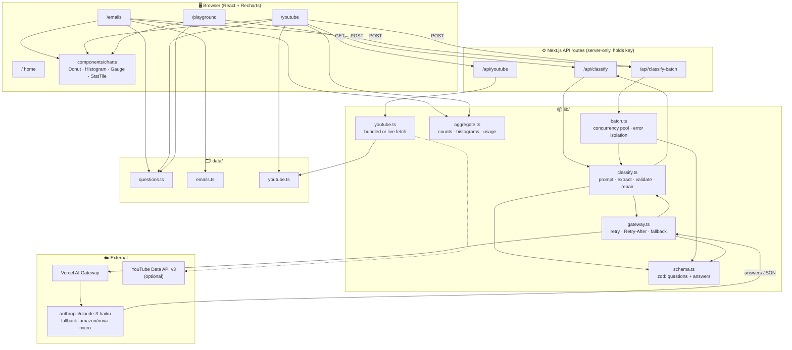
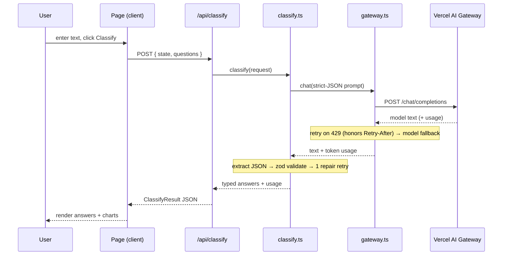
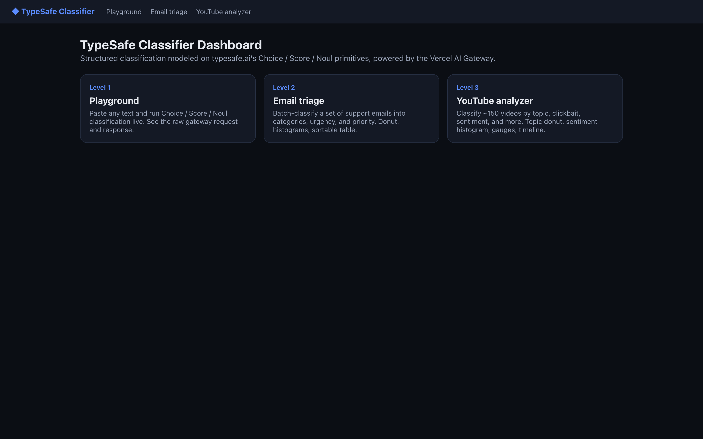
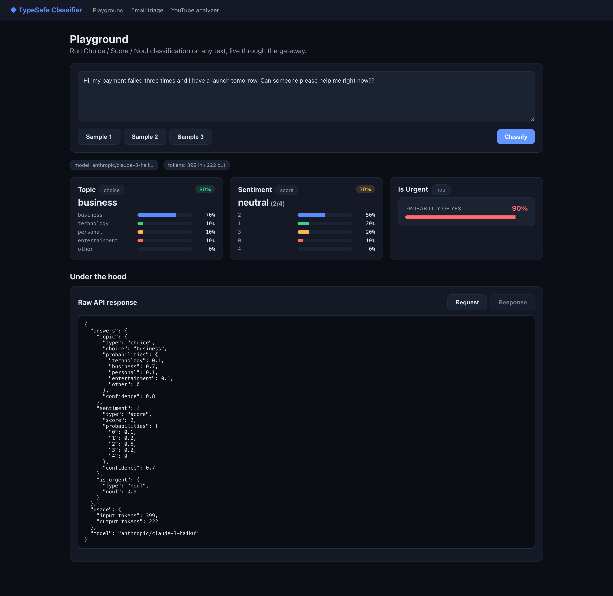
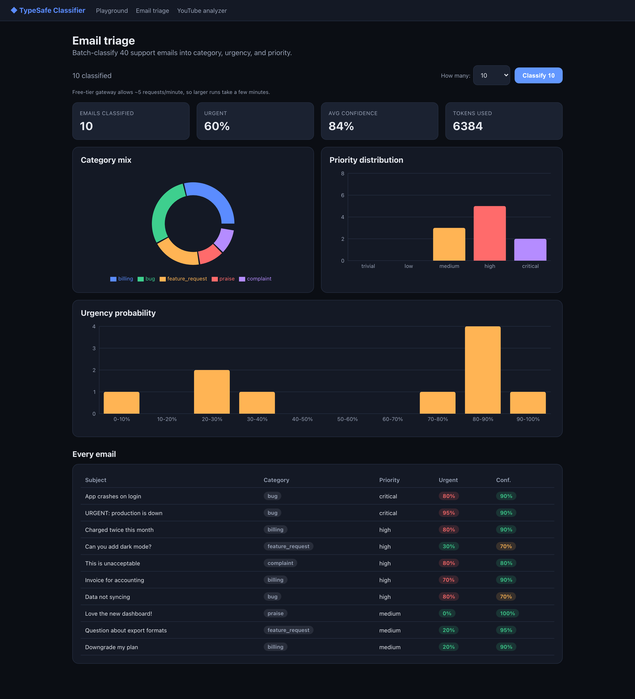
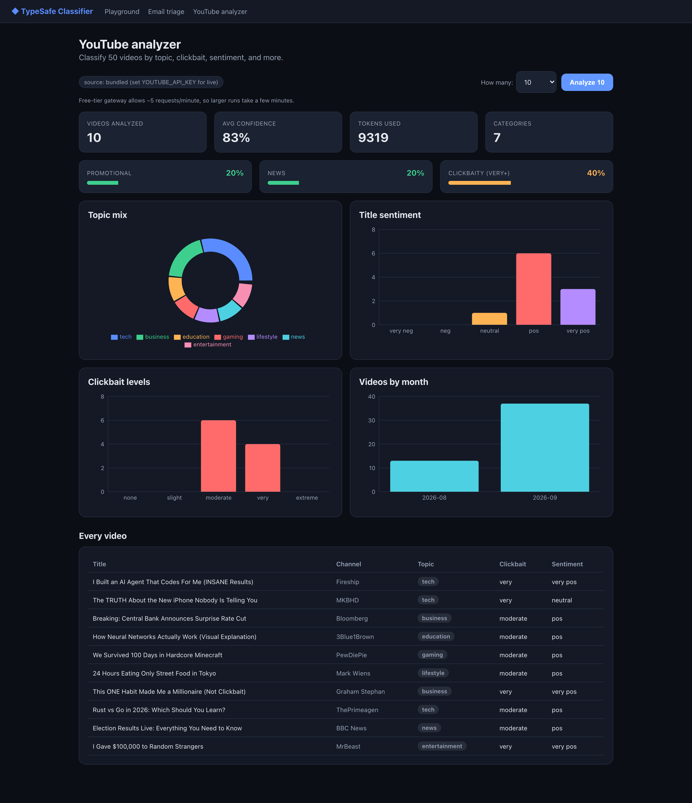

# TypeSafe Classifier Dashboard

Run **structured text classification** — not free-text generation — and see the results
told as a visual story. This app takes any text (support emails, video titles, anything you
paste) and returns typed, machine-readable answers with confidence scores, then charts them
across three dashboards. Local-first, powered by the [Vercel AI Gateway](https://vercel.com/docs/ai-gateway).

## What it is

Most LLM apps ask a model to *write* something. This one asks a model to *decide* something,
in a strict shape you define. It is modeled on [typesafe.ai](https://docs.typesafe.ai/introduction)'s
three decision primitives:

| Primitive | Meaning | Returns |
|-----------|---------|---------|
| **Choice** | pick one option from a set | choice + per-option probabilities + confidence |
| **Score** | rate on an ordered rubric (2–10 levels) | level + probabilities + confidence |
| **Noul** | yes/no | probability of "yes" (0–1) |

Every question is atomic and evaluated independently, then composed in application code —
so complex judgments become small, testable decisions instead of one fuzzy prompt.

> **Note:** typesafe.ai / Jev has its own separate API and key. This project **emulates**
> those primitives through a general model on the Vercel AI Gateway, so it runs with a
> standard `vck_...` gateway key.

## The three dashboards

1. **Playground** — classify any text live and inspect the raw gateway request/response.
2. **Email triage** — batch-classify support emails into category, urgency, and priority. Donut, histograms, sortable table.
3. **YouTube analyzer** — classify videos by topic, clickbait, sentiment, promotional/news. Topic donut, sentiment & clickbait histograms, gauges, timeline, table.

## Architecture

Every page talks only to a server-side API route; the route calls a small classification
library; the library calls the gateway. The API key never reaches the browser.



### A single classification request



## Technologies

- **Framework:** Next.js 14 (App Router), React 18, TypeScript
- **AI:** Vercel AI Gateway (OpenAI-compatible), default model `anthropic/claude-3-haiku`
- **Validation:** zod (single source of truth for question/answer shapes)
- **Charts:** Recharts
- **Testing:** Vitest + Testing Library (21 unit tests)
- **Screenshots (dev only):** Playwright, via `scripts/screenshots.mjs`

### Key terms

- **Choice / Score / Noul** — the three decision primitives (see the table above). "Noul" is
  a yes/no question answered as a probability.
- **State** — typesafe.ai's word for the input being evaluated (here: an email or a video's text).
- **Confidence** — how sure the model is about a Choice/Score answer, 0–1.
- **Vercel AI Gateway** — a single OpenAI-compatible endpoint that routes to many model providers.
- **zod** — a TypeScript schema library used to validate the model's JSON before the UI trusts it.

## Setup

```bash
cp .env.example .env.local     # then paste your Vercel AI Gateway key
npm install
npm run dev                    # http://localhost:3000
```

### Environment variables

| Var | Required | Purpose |
|-----|----------|---------|
| `AI_GATEWAY_API_KEY` | yes | Your Vercel AI Gateway key (`vck_...`). |
| `CLASSIFIER_MODEL` | no | Model id. Default `anthropic/claude-3-haiku`. |
| `YOUTUBE_API_KEY` | no | Enables the live YouTube Data API path. Without it, the bundled sample is used. |

### A note on rate limits

The gateway **free tier allows ~5 requests per minute**. The classifier honors the server's
`Retry-After`, so batches always complete — they just take a few minutes for larger runs. The
dashboards default to classifying 10 items; use the selector for more. Paid credits remove the cap.

## Testing

```bash
npm test        # 21 unit tests (schema, gateway, classify, batch, aggregate, charts)
npm run build   # typecheck + production build
```

> Tip: don't run `npm run build` while `npm run dev` is running — the build rewrites `.next`
> and breaks the dev server until restart.

## Roadmap

The full plan lives in [docs/ROADMAP.md](docs/ROADMAP.md). Highlights:

- Real datasets (public corpora + CSV/JSON upload) and a paste-in mode.
- Multi-model comparison: run the same classification across several models and compare agreement.
- Swap in the real typesafe.ai / Jev API and compare against the emulated primitives.
- Persistence (SQLite), result export, and a live YouTube fetch path.

## Demo









## About

Built to explore structured LLM classification (Choice/Score/Noul), the Vercel AI Gateway,
and Next.js — turning fuzzy model output into typed, validated, chartable decisions.
